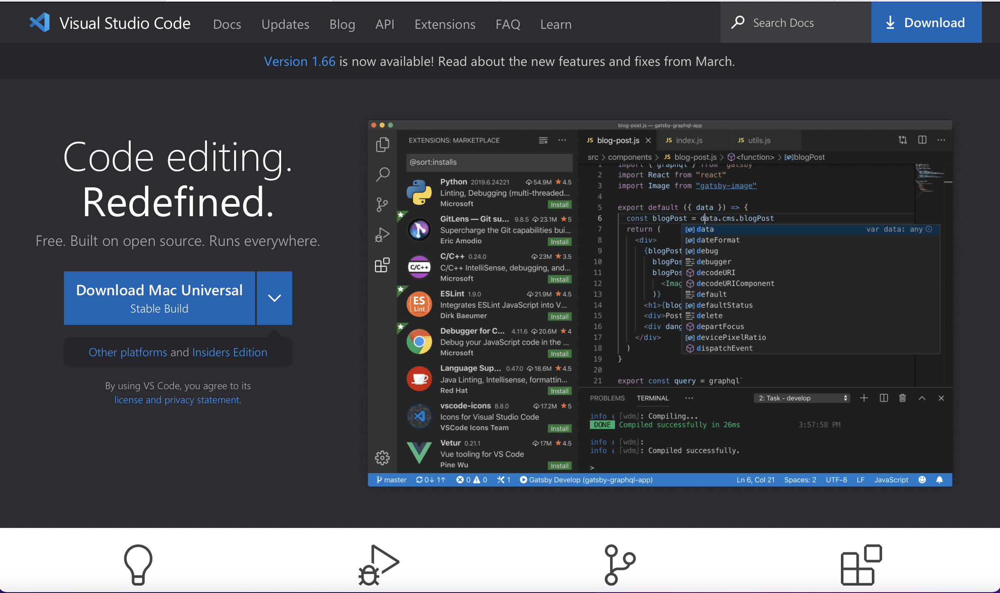
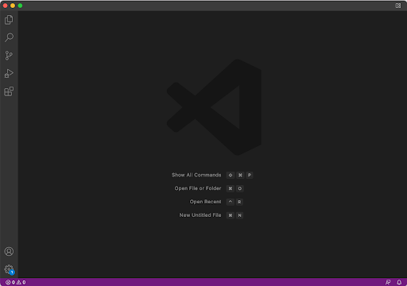
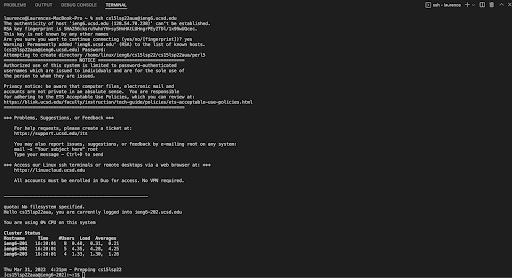
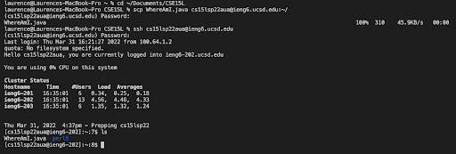
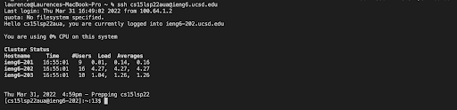
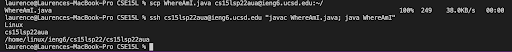

# Lab Report 1 Week 2
## Installing Visual Studio Code
Go to the offcial [Visual Studio Code](https://code.visualstudio.com) and click the "Download" button.

Follow the steps in the installation package. When you install successfully, open Visual Studio Code and you should see a page like this:

## Remotely Connecting
Open a terminal in VScode and type the following code (replace "zz" with your personal account code on [UCSD ETS](https://sdacs.ucsd.edu/~icc/index.php)):

`$ ssh cs15lsp22zz@ieng6.ucsd.edu`

Type "yes" when you are asked "Are you sure you want to continue connecting" and then type your password. Now, your personal computer is connected to UCSD CSE server.

When you are connected to the server successfully, you should see a login welcoming message, CPU usage, cluster status, and login time like below:

## Trying Some Commands
Now, as you have connected to the server, let's try some commands.
These are some commands you can try yourself in the terminal:

* `cd`
* `ls`
* `pwd`
* `mkdir`
* `cp`

Here is an exemple of my running result of `ls` command:

Tip: You can use up-arrow to recall your previous command, which is a cool feature that saves you effort.

## Moving Files with `scp`
To make use of our online server, you need to copy files to the server first. To copy a file and move it from client to server, we need `scp` command. Now, create a file on your computer with any name and any code you want. Then, type the following command (replace "fileName" with the name you used for your file and "zz" with your personal account code on [UCSD ETS](https://sdacs.ucsd.edu/~icc/index.php)):

`scp fileName.java cs15lsp22zz@ieng6.ucsd.edu:~/`

I moved a file called `whereAmI.java` and moved it with `scp` command:

## Setting an SSH Key
Every time we access the server with `ssh` command or copy files to the server with `scp` command, we have to type in the password to our account. This is too much work, and it gets so frustrating when you type the wrong password a few times in a row. Fortunately, we have a way to save our passwords with `ssh-keygen`.

Here is what you need to type:

`$ ssh-keygen`

It will ask you to enter a paraphrase. Make sure that you do not enter a paraphrase and continue.

Your private key will be saved in `/Users/<user-name>/.ssh/id_rsa`. Your public key will be saved in `/Users/<user-name>/.ssh/id_rsa.pub`.

Then, copy the PUBLIC (not *private*) key to the `.ssh` directory of the server.

In my screenshot, you can see that I no longer need password.

## Optimizing Remote Running
When you make a local edit to a file, upload it to the server, and run it, you need to type several lines to achieve that. However, it is actually possible to perform several commands in one line.

Here is what I did:

In my example, I managed to copy, compile, and run the file on the server in one line.
