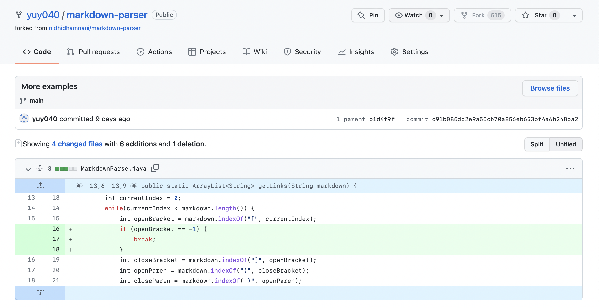
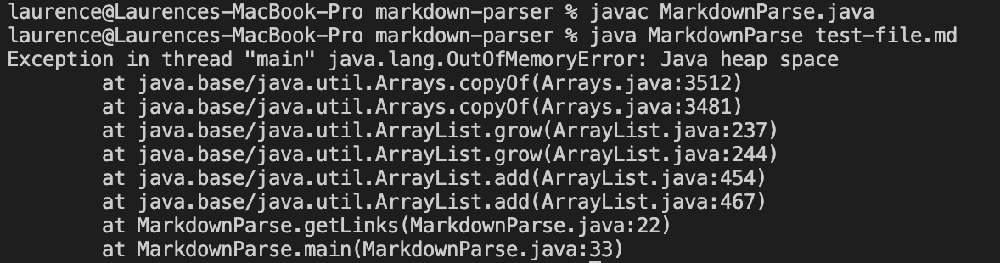
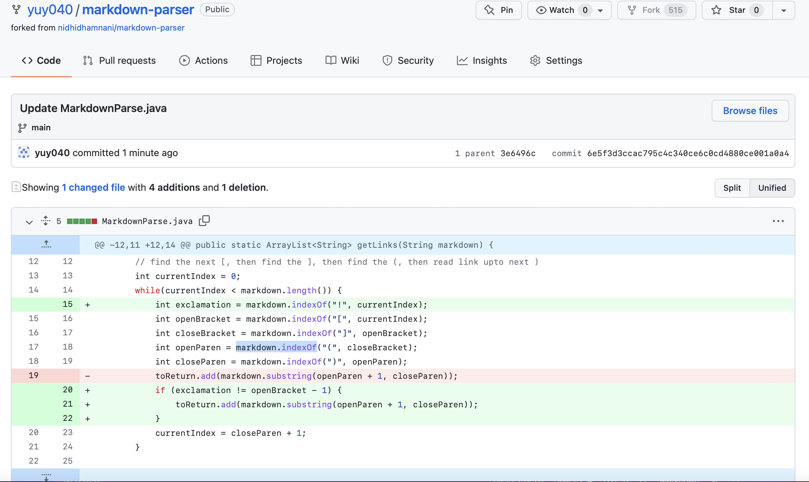
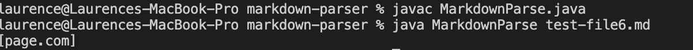
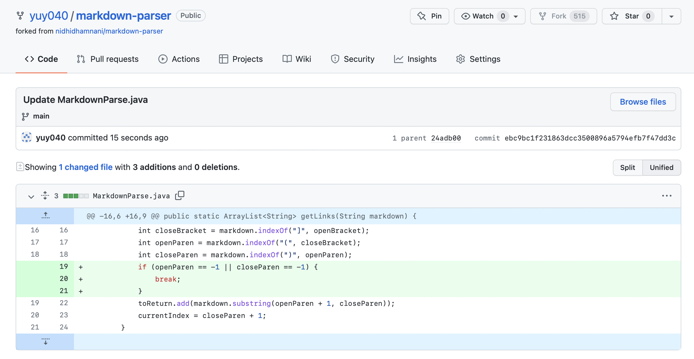
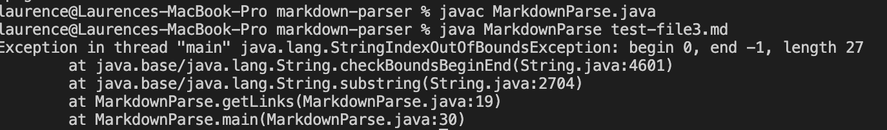

# Lab Report 2 Week 4
## Change 1
Code change:

[Test file](https://github.com/yuy040/markdown-parser/blob/main/test-file.md) for a failure-inducing input.

Symptom of the failure-inducing input:

The symptom is caused by an infinite loop while running. As there is an extra blank line after two links, the while loop does not stop when `currentIndex` reaches the end of the link. As a result, the program will search for the next open bracket, which cannot be find, so `openBracket` has value -1 and the program starts all over again.

To fix the bug, I added a statement to determine if the value of `openBracket` is -1. If it is, terminate the loop with `break` statement.

## Change 2
Code change:

[Test file](https://github.com/yuy040/markdown-parser/blob/main/test-file6.md) for a failure-inducing input.

Symptom of the failure-inducing input:

The test file includes a picture, whose link should not be part of the output. This happens because the program cannot distinguish the link for a website and the link for a picture.

To fix the bug, I added `exclamation` for the index of the exclamation mark in the picture format. If `exclamation` is just before `openBracket`, this is a picture and skip it.

## Change 3
Code change:

[Test file](https://github.com/yuy040/markdown-parser/blob/main/test-file3.md) for a failure-inducing input.

Symptom of the failure-inducing input:

The input lacks the perentheses in the correct link format. The symptom of out of bounds occurs because both `openParen` and `closeParen` are both -1 when there are no perentheses.

To fix the bug, I added a statement to determine whether `openParen` or `closeParen` is -1. If it is, terminate the loop with `break` statement. Now the program works correctly.