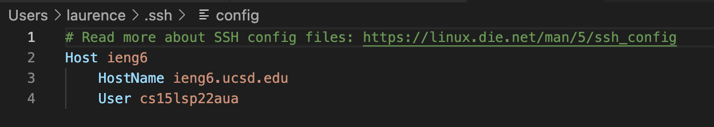
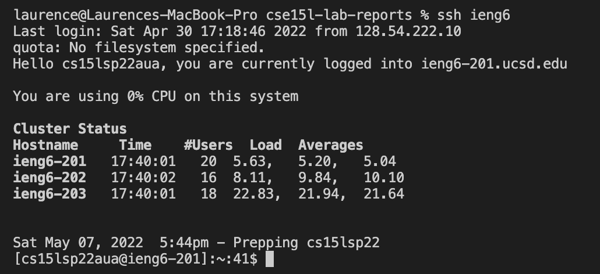
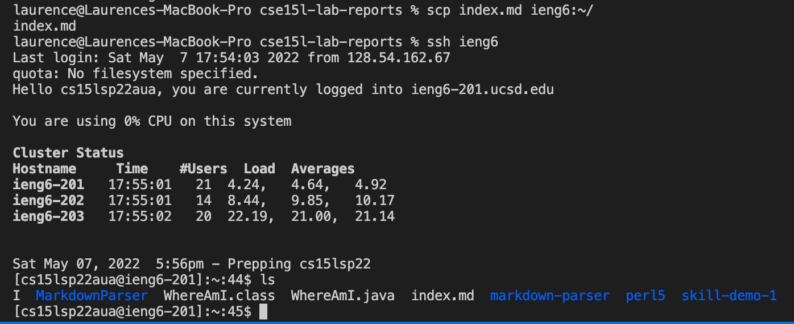

# Lab Report 1 Week 2
## Streamlining ssh Configuration
Here is screenshot of my `.ssh/config` file, and I edited it with VScode.\

To login my account, I do not need to type my username and password; instead, I only need one command `ssh ieng6` to login my account. Here is a screenshot of my command:\

I used `scp` command to copy a markdown file `index.md` to the remote server. Now, I do not need my account name, as shown below:\

## Setup Github Access from ieng6
