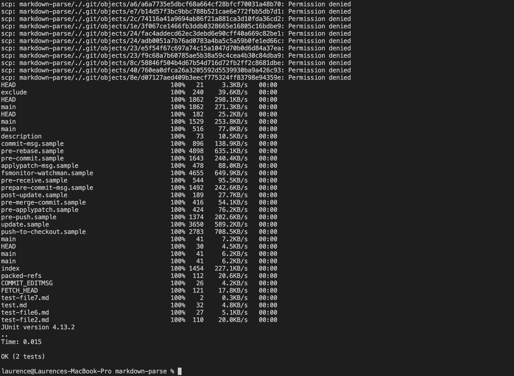

# Lab Report 3 Week 6
## Streamlining ssh Configuration
Here is screenshot of my `.ssh/config` file, and I edited it with VScode.\

To login my account, I do not need to type my username and password; instead, I only need one command `ssh ieng6` to login my account. Here is a screenshot of my command:\

I used `scp` command to copy a markdown file `index.md` to the remote server. Now, I do not need my account name, as shown below:\

## Setup Github Access from ieng6
My public key is called `id_rsa.pub`. It is stored in `cse15l-lab-reports` repository on GitHub and in `.ssh` directory in my user account.\

My private key is called `id_rsa`. It is also stored in `.ssh` directory in my user account.\

On the remote server, I made some changes to `MarkdownParseTest.java`, committed it, and then pushed it to GitHub with `git` commands.

Here is a [link](https://github.com/yuy040/markdown-parser/commit/304c92db39700e15cd79eba9b6fbcfb4eb1bf085) for my commit.

## Copy Whole Directories with `scp -r`
I used the command `scp -r . ieng6:markdown-parse` to copy the whole `markdown-parse` directory:

I logged into the remote server, and then I compiled and ran the file successfully:

I combined all command in a line, and here is my result:

