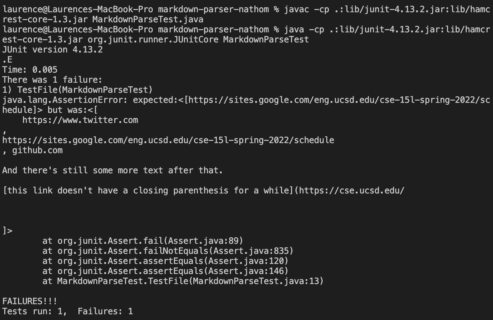

# Lab Report 4 Week 8
## Links to Repositories
Here is [the link to my repository](https://github.com/yuy040/markdown-parser) and [the link to the repository I reviewed](https://github.com/nathom/markdown-parser).

## Test 1

The expected output should be:\
["`google.com", "google.com", "ucsd.edu"]

This is how I terned it into a test:

The test in my implementation did not pass:

The test in the implementation I revealed did not pass either:

I think a small code change will make the program work. I can find the index of the first and second backsticks. If the first one is before the open bracket and the second one is before the close bracket, then the link should not be included.

## Test 2

The expected output should be:\
["a.com", "a.com(())", "example.com"]

This is how I terned it into a test:

The test in my implementation did not pass:

The test in the implementation I revealed did not pass either:

I think a small code change will make the program work. I can find the index of all close perentheses. Then, use the index of the last close perenthesis as the end of the link so that all other close perentheses can be included as part of the link.

## Test 3

The expected output should be:\
["https://sites.google.com/eng.ucsd.edu/cse-15l-spring-2022/schedule"]

This is how I terned it into a test:

The test in my implementation did not pass:

The test in the implementation I revealed did not pass either:

I think a small code change is not enough make the program work. First, I need to fix the infinite loop by checking if `openBracket`, `closeBracket`, `openParen`, or `closeParen` equals `-1`. If one of them does, use `break` to quit the loop. Then, I need to check if there is a line break in the middle of the text. If there is, the link should not be included in the output. Finally, I need to exclude the lines without close parentheses.