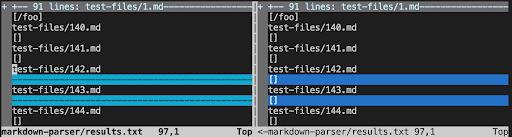
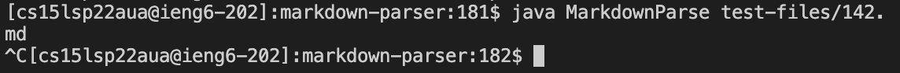
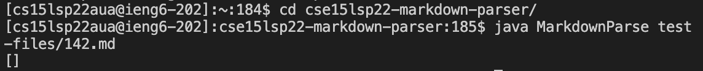
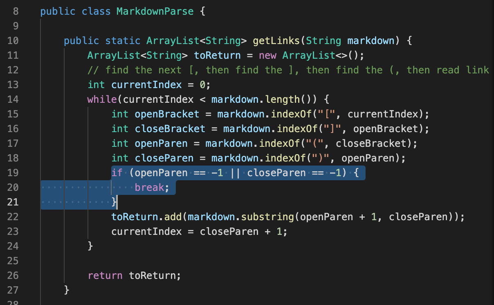
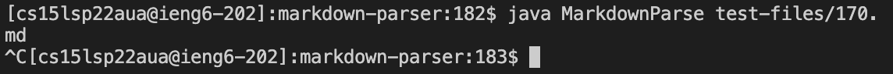
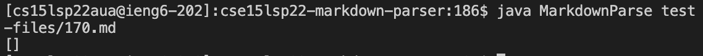

# Lab Report 5 Week 10
## Different Results
I used `vimdiff` on the results of running a bash for loop. Here is an example of the result I got after I ran the command:

I found that test files `142.md` and `170.md` have different results. Here are the links to them:\
[142.md](https://github.com/nidhidhamnani/markdown-parser/blob/main/test-files/142.md)\
[170.md](https://github.com/nidhidhamnani/markdown-parser/blob/main/test-files/170.md)

## Test File `142.md`
The expected output should be:\
[]

The result of my code:\
I got no result because of an infinite loop:

The result of the given code:\

The result of the given code is correct.

In the test file, there are perentheses but no brackets. I got the wrong result because I did not check the condition when the program could not find the perentheses. I should add another `if` statement to check whether `openBracket` or `closeBracket` is `-1`.

## Test File `170.md`
The expected output should be:\
[]

The result of my code:\
I got no result because of an infinite loop:

The result of the given code:\

The result of the given code is correct.

In the test file, there are not neither parentheses nor brackets. I got the wrong result because I did not check the condition when the program could not find the perentheses. I should add another `if` statement to check whether `openBracket`, `closeBracket`, `openParen`, or `closeParen` is `-1`.
